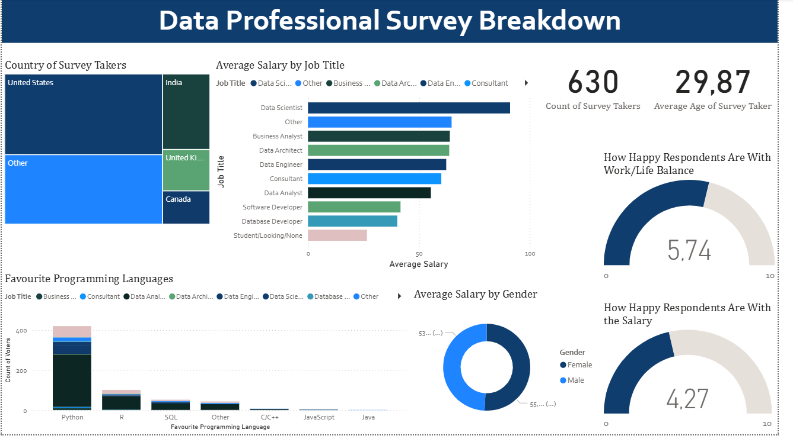

# Power BI Dashboard – Data Professionals Survey

## Overview
This dashboard was built in Power BI based on a real survey of 630 individuals either working in or aspiring to enter the field of data analytics. The dataset comes from Alex The Analyst’s bootcamp, where participants were encouraged to replicate and expand the final project for portfolio use.

I followed the core structure of the bootcamp project, but extended the scope by cleaning and grouping additional data for the fields such as:
- Job Titles
- Industry Sector
- Favourite Programming Languages

This project helped solidify my skills in Power BI, dashboard layout, DAX basics, and insight communication - and serves as a foundation for future custom projects.

---

## Key Insights
- Data Scientists reported the highest average salary, followed by Business Analysts and Architects.
- The majority of respondents were from the US, India, and the UK.
- Python was by far the most preferred language across roles.
- Work/Life balance scored higher than Salary satisfaction, indicating a gap in compensation expectations across regions.

---

## Tools Used
- Power BI
- Excel
- Data cleaning in Power BI query editor

---

## Files Included
- `Visualization_for_the_Project.pbix` – Full interactive report
- `Screenshot_of_the_dashboard.png` – Static view of the dashboard
- `Data_Source_Notes.txt` – Description of the data source and usage license

---

## Dashboard Preview

---

## Notes
This project is part of my data analytics portfolio and was developed as a guided but customized learning exercise. While the structure was based on an existing bootcamp tutorial, all visuals were recreated by me, and the enhancements were made independently.

